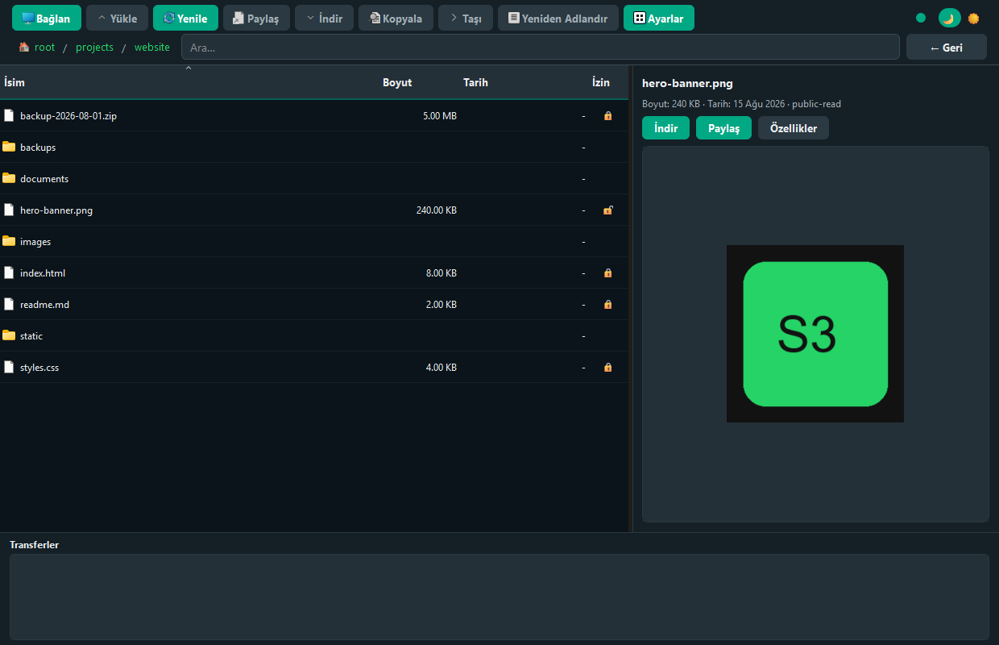

<div align="center">

# S3MANAGER

**Cross-platform desktop file manager for DigitalOcean Spaces and other S3-compatible storage services**

[](LICENSE)
[](https://github.com/bahadirdogru/S3MANAGER/releases)
[](https://www.python.org/)
[](https://doc.qt.io/qtforpython/)
[](https://github.com/bahadirdogru/S3MANAGER/releases)
[](https://s3manager.bahadirdogru.com/)

[Features](#features) · [Installation](#installation) · [Website](https://s3manager.bahadirdogru.com/) · [Roadmap](#roadmap) · [Usage](#usage) · [Distribution](#distribution-local-build) · [Documentation](#documentation)

</div>

---

> **Doc Map** — Project documentation guide
>
> | File | What to read it for |
> |------|---------------------|
> | [README.md](README.md) | Installation, usage, project overview (English — GitHub/GitLab homepage) |
> | [readmetr.md](readmetr.md) | Kurulum, kullanım, proje tanıtımı (Türkçe) |
> | [docs/](docs/) | Marketing website ([s3manager.bahadirdogru.com](https://s3manager.bahadirdogru.com/)) |
> | [UI.md](UI.md) | Color, font, widget, and QSS design standards |
> | [ARCHITECTURE.md](ARCHITECTURE.md) | Architecture layers, data flow, threading (human-readable) |
> | [LLM.md](LLM.md) | Current code structure, file map, development constraints (LLM) |
> | [PROCESS.md](PROCESS.md) | Chronological change log (changelog) |
>
> Turkish version: [readmetr.md](readmetr.md)

## About

**S3MANAGER** lets you manage files on DigitalOcean Spaces with a local desktop application experience. Upload, download, sharing, and folder management come together in a single modern interface.

This project is developed by [Bahadır Doğru](https://bahadirdogru.com) under the name **S3MANAGER** and is released as open source under the **GPL-3.0** license.

## Features

<table>
<tr>
<td width="50%" valign="top">

### 📁 File Explorer
- Folder tree view
- Paginated lazy loading
- Breadcrumb navigation
- Column sorting, multi-select
- Copy / move / rename (F2, Ctrl+C/X)
- Toolbar search (prefix filter)
- Right-panel file preview (images, text)

### ⬆️ Upload
- File and folder upload
- Drag-and-drop onto main window
- Private / Public ACL
- Automatic Content-Type and Content-Disposition (html, zip, css, js, etc.)
- Multipart (>100 MB)
- Parallel uploads (max 3)

</td>
<td width="50%" valign="top">

### ⬇️ Download & Share
- Single / multi-file download
- Folder download
- 3- or 7-day presigned URLs
- Automatic clipboard copy

### 🎨 Modern UI
- PySide6 (Qt 6)
- WhatsApp-inspired dark/light theme
- Qt standard toolbar icons
- Transfer history panel
- Details: [UI.md](UI.md)

</td>
</tr>
</table>

### Screenshot



More screenshots: [marketing site](https://s3manager.bahadirdogru.com/#ekran-goruntuleri) · Refresh: `python scripts/capture_screenshots.py`

## Requirements

- Python 3.10+
- DigitalOcean Spaces account and access keys

## Installation

### From source (development)

**Quick start** (Linux/macOS/Git Bash):

```bash
git clone https://github.com/bahadirdogru/S3MANAGER.git
cd S3MANAGER
./start.sh
```

`start.sh` creates a venv, installs dependencies, and starts the app. On Windows, use Git Bash or WSL.

**Manual setup:**

```bash
git clone https://github.com/bahadirdogru/S3MANAGER.git
cd S3MANAGER
python -m venv venv
venv\Scripts\activate          # Windows
# source venv/bin/activate     # Linux/macOS
pip install -r requirements.txt
python src/main.py
```

On first run, use **Connect** to enter Key, Secret, Region, Endpoint, and Bucket. Credentials are saved to `~/.s3manager/config.ini`.

> **Note:** If you used an older version before, settings in `~/.pydamlaspace/` are automatically migrated to `~/.s3manager/` on first launch.

### Binary (end user)

To use without installing Python, download the file for your platform from [Releases](https://github.com/bahadirdogru/S3MANAGER/releases) (see the [Releases](#releases) section below).

## Roadmap

Prioritized development plan for S3-compatible storage (boto3). Items are ordered by gaps in the current codebase; contributions and suggestions are welcome via [Issues](https://github.com/bahadirdogru/S3MANAGER/issues).

### Near term — core S3 operations

| Feature | Description | Status |
|---------|-------------|--------|
| **Multiple connection profiles** | Save multiple bucket/endpoint entries; quick switching | Planned |
| **Credential security** | OS keyring or encrypted credential storage | Planned |
| **Presigned upload URL** | `put_object` presigned sharing | Planned |
| **Public / CDN URL display** | Direct URL for public-read objects | Planned |

### Mid term — productivity and management

| Feature | Description | Status |
|---------|-------------|--------|
| **Upload resume** | Resume interrupted multipart uploads | Planned |
| **Bucket management (boto3)** | CORS, lifecycle, versioning, policy, logging, website | Planned |
| **Object tagging** | `get/put_object_tagging` — DO compatibility needs testing | Planned |

### DigitalOcean Platform API (outside boto3)

Does **not** work with Spaces access keys; requires a separate **DO API token**.

| Feature | API | Status |
|---------|-----|--------|
| **CDN cache purge** | `DELETE /v2/cdn/endpoints/{id}/cache` | Planned |
| CDN endpoint list / TTL / custom domain | `/v2/cdn/endpoints` | Planned |

### Long term — later

| Feature | Description | Note |
|---------|-------------|------|
| **File preview (advanced)** | PDF viewer, more formats, editing | Basic split-view preview added; PDF and advanced types deferred |

### Completed (v0.0.7+)

- **Object properties** — Content-Type, Cache-Control, `x-amz-meta-*`, ACL editing (context menu / preview)
- **Incomplete multipart management** — Settings → Maintenance tab (list / abort)
- **Bulk file deletion** — `delete_objects` batch API
- **Rename / move / copy** — context menu, toolbar, F2/Ctrl+C/Ctrl+X
- **Prefix search and filter** — toolbar search box (current folder)
- **Drag-and-drop upload** — drop files onto main window
- **Transfer history** — upload/download records in bottom panel
- **Toolbar icons** — Qt standard icon set
- **File preview (MVP)** — split-view right panel; image and text files

### Deliberately out of scope (for now)

- Full IAM/STS management console
- Glacier / deep archive storage class transitions
- Server-side encryption (SSE-KMS) configuration wizard

## Releases

Latest version: **[v0.0.8](https://github.com/bahadirdogru/S3MANAGER/releases/tag/v0.0.8)** — download from [GitHub Releases](https://github.com/bahadirdogru/S3MANAGER/releases). Changelog: [PROCESS.md](PROCESS.md).

| Platform | File | Min. macOS |
|----------|------|------------|
| Windows | `S3MANAGER-0.0.8-windows-setup.exe` (NSIS installer) or `S3MANAGER-0.0.8-windows-portable.zip` | — |
| macOS (Apple Silicon) | `S3MANAGER-0.0.8-macos-arm64.dmg` | 13 Ventura+ |
| macOS (Intel) | `S3MANAGER-0.0.8-macos-x86_64.dmg` | 10.13 High Sierra+ |
| Linux x86_64 | `S3MANAGER-0.0.8-linux-x86_64.tar.gz` or `S3MANAGER-0.0.8-linux-x86_64.AppImage` | — |

**macOS:** Apple Silicon (M-series) Macs should download `macos-arm64.dmg`. Intel Macs should use `macos-x86_64.dmg`.

The app checks for updates from GitHub Releases on startup. Manual check is available in **Settings → Help**. If a new version is found, the download page opens in your browser.

> **Note:** Binaries are not code-signed; Windows Defender / macOS Gatekeeper may show warnings.

### Release for developers

```bash
# Update version in src/version.py, commit
git tag v0.0.8
git push origin main
git push origin v0.0.8
```

When a `v*.*.*` tag is pushed, GitHub Actions automatically builds on Windows, macOS (arm64 + Intel x86_64), and Linux, and creates a [GitHub Release](https://github.com/bahadirdogru/S3MANAGER/releases) (6 binary artifacts).

> **macOS development note:** Daily development and CI use PySide6 only. The Intel Mac (10.13+) DMG is produced separately at release time via the PySide6→PySide2 shim in `build/macos_x86_64/` and **python-build-standalone** Python. You do not need PySide2 in your local venv. Details: [build/macos_x86_64/README.md](build/macos_x86_64/README.md)

## Distribution (local build)

Local builds with PyInstaller **onedir** must run on the target platform (no cross-compile).

| Platform | Command | Output |
|----------|---------|--------|
| Windows | `.\scripts\package-windows.ps1 -Version 0.0.8` | NSIS installer + portable zip |
| macOS (arm64) | `./scripts/package-macos.sh 0.0.8` | `*-macos-arm64.dmg` (PySide6) |
| macOS (Intel x86_64) | `./scripts/package-macos.sh 0.0.8` (on Intel Mac) | `*-macos-x86_64.dmg` (PySide2 + shim; see [build/macos_x86_64/README.md](build/macos_x86_64/README.md)) |
| Linux | `./scripts/package-linux.sh 0.0.8` | `.tar.gz` + `.AppImage` |
| All (build only) | `.\scripts\build.ps1` / `./scripts/build.sh` | `dist/S3MANAGER/` |

Windows packaging requires [NSIS](https://nsis.sourceforge.io/) (`makensis` in PATH or via Chocolatey: `choco install nsis`). CI installs NSIS via Chocolatey. Icon generation: `python scripts/generate_icons.py` (requires Pillow).

`s3manager.spec` packages only the PySide6 modules required for QtWidgets (does not use `collect_all`). Scripts create a venv, install `requirements.txt` + `requirements-dev.txt`, and build with PyInstaller.

**Known limitations:** Windows Defender / macOS Gatekeeper may warn about unsigned binaries.

## Usage

### Connection

1. **Connect** → enter credentials (connection is validated)
2. If saved credentials exist, the app connects automatically

### File explorer

- Double-click a folder; navigate with breadcrumbs at the top (list cache used when going back)
- **← Back**, **Refresh**, click column headers to sort
- Multi-select with Ctrl/Shift; right-click menu

### Upload

1. **Upload** → Select File or Folder (each selection replaces the list)
2. Choose Private/Public → **Start Upload**
3. Progress: percentage, speed, multipart info

**Content-Type** and **Content-Disposition** are set automatically based on file extension (e.g. `.html` opens in browser, `.zip` downloads). Rules can be customized via **Settings → Upload Metadata...** or **Settings...** in the upload dialog (`~/.s3manager/config.ini` `[upload_metadata]`).

### Download

1. Select file(s)/folder → **Download** or right-click **Download Selected**
2. Choose destination folder

### Share

1. Select a single file → **Share** (3/7 day choice) or right-click menu
2. Link is copied to clipboard automatically

### Settings

Toolbar **Settings** → tabbed dialog:

| Tab | Function |
|-----|----------|
| Connection | Saved bucket/region/endpoint; edit connection |
| Upload Metadata | Content-Type / Disposition / Cache-Control rules |
| Appearance | Dark / light theme |
| Log | Last lines of `app.log` |
| Maintenance | List / abort incomplete multipart uploads |
| Help | Version, update check, GitHub Releases |

### Object properties

With a single file selected, right-click **Properties** or **Properties** in the preview panel → edit Content-Type, Cache-Control, custom metadata (`x-amz-meta-*`), and ACL (private / public-read).

### Other

- Right-click empty area → **New Folder**, **Upload File**
- **Settings** → all configuration and help
- Toolbar **●** connection indicator (green = connected); click to Connect
- Toolbar **🌙/☀️** for dark/light theme
- **Del** delete, **F5** refresh, **Ctrl+A** select all, **F2** rename, **Ctrl+C/X** copy/move
- Drag-and-drop onto main window to upload

## Logging

`~/.s3manager/app.log`: RotatingFileHandler, 10MB, 5 backups. See [ARCHITECTURE.md](ARCHITECTURE.md) for details.

## Configuration

`~/.s3manager/config.ini` — example: [config.example.ini](config.example.ini)

## Supported regions

`nyc3` · `sfo3` · `sgp1` · `ams3` · `fra1` · `blr1`

## Development

### Tests

```bash
pip install -r requirements-dev.txt
pytest                                    # all tests (93)
pytest tests/unit -v                      # unit only
pytest --cov=src --cov-report=html        # HTML report → htmlcov/
sh scripts/test.sh                        # venv + pytest (Git Bash)
```

Marketing site screenshots: `python scripts/capture_screenshots.py` · OG image: `python scripts/generate_og_image.py`

Configuration: [`pyproject.toml`](pyproject.toml). CI runs a `pytest` job on `ubuntu-latest`; the build matrix starts only after tests pass.

| Layer | Tool | Directory |
|-------|------|-----------|
| Unit | pytest | `tests/unit/` |
| Service (S3 mock) | pytest + moto | `tests/services/` |

GUI (PySide6) tests are out of scope.

## Development note

**LLM (Large Language Model)** tools were used during the coding process for this project. Architecture decisions, code structure, and development constraints are documented in [LLM.md](LLM.md).

## Documentation

| File | Content |
|------|---------|
| [docs/](docs/) | Marketing site — [s3manager.bahadirdogru.com](https://s3manager.bahadirdogru.com/) |
| [PROCESS.md](PROCESS.md) | Change history (changelog) |
| [ARCHITECTURE.md](ARCHITECTURE.md) | Architecture and data flow |
| [UI.md](UI.md) | Design system |
| [LLM.md](LLM.md) | LLM development guide |

---

<div align="center">

## Author & License

**S3MANAGER** — Copyright © 2026 [Bahadır Doğru](https://bahadirdogru.com)

This project is released as open source under the [GNU General Public License v3.0](LICENSE).

</div>
